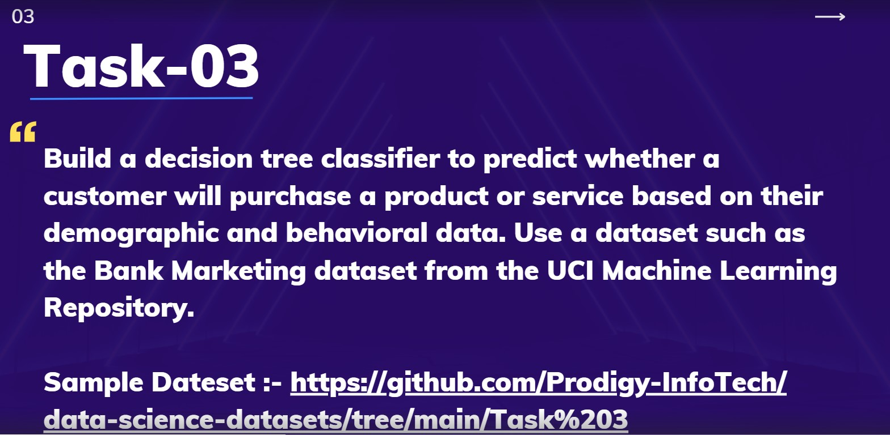

# PRODIGY_DS_03
# Prodigy Infotech – Data Science Internship (Task 3)

Hi there!

I am **Uthandam**, and this repository showcases my submission for Task 3 of the Prodigy Infotech Data Science Internship. In this task, I conducted an exploratory data analysis (EDA) on a bank marketing dataset to derive actionable insights into customer behavior and campaign effectiveness.

## 📋 Problem Statement
The objective was to analyze a bank marketing dataset to identify patterns and factors influencing customer subscription to term deposits, leveraging demographic, economic, and campaign-related data.
---

##🌍 About the Dataset
This project utilizes the Bank Marketing Dataset, which contains records from a Portuguese banking institution's direct marketing campaigns:

Source: Provided dataset (bank-additional.csv)
Observations: 4,111 client records (sample subset provided)
Key Features:

Demographic: age, job, marital, education
Financial: default, housing, loan
Campaign: contact, month, day_of_week, duration, campaign, pdays, previous, poutcome
Economic: emp.var.rate, cons.price.idx, cons.conf.idx, euribor3m, nr.employed
Target: y (subscription: yes/no)

🧰 Tools & Libraries
This project was executed using Python in a Jupyter Notebook environment, with:

pandas and numpy for data manipulation and analysis
matplotlib and seaborn for data visualization

🔍 What I Did – A Quick Walkthrough
1. Data Exploration

Reviewed the dataset structure and summarized key statistics.
Identified missing values and data distributions.

2. Data Cleaning

Handled missing or ambiguous entries (e.g., "unknown" values).
Standardized data formats for consistent analysis.

3. Visualization & Analysis

Created bar charts to examine job and marital status distributions.
Plotted line graphs to analyze campaign duration trends by month.
Generated heatmaps to explore correlations between economic indicators and subscription rates.
Used boxplots to detect outliers in age and campaign duration.

💡 Key Takeaways

Customer Segmentation: Job roles (e.g., admin, blue-collar) and marital status show varying subscription tendencies.
Campaign Insights: Longer call durations, particularly in certain months, correlate with higher subscription rates.
Economic Impact: Economic indicators like employment variation rate influence campaign success.
Outliers: Age and campaign duration contain outliers that may affect analysis outcomes.

🎯 Conclusion
This task provided a comprehensive opportunity to perform EDA on a real-world banking dataset, transforming raw data into meaningful insights. The analysis highlights the importance of customer segmentation and campaign timing in driving subscription rates, offering valuable perspectives for marketing strategy optimization.
Thank you for reviewing my work! 😊
